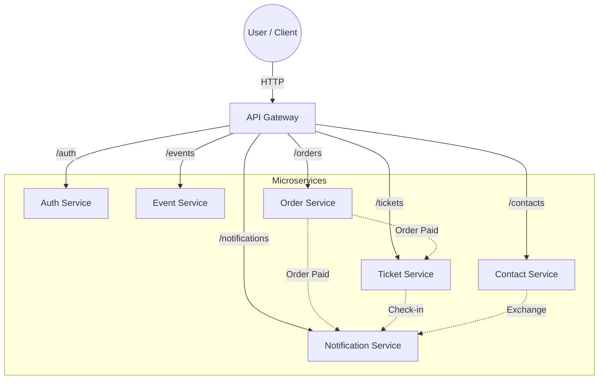

<div align="center">

# 🤝 Ketemu

### Conference & Networking Platform

[](https://docs.oracle.com/en/java/)
[](https://spring.io/projects/spring-boot)
[](https://www.docker.com/)
[](https://www.postgresql.org/)
[](LICENSE)

**Ketemu** is a conference management and networking platform built as a **Java microservices** portfolio project. The name is a nod to its roots: "Ketemu" means "to meet" in Javanese (spoken on the island of Java), bridging the concept of social networking with the **Java** language that powers it.
It simulates a real-world system for managing conferences, tickets, networking via QR codes, and cross-service notifications.

</div>

---

## 📑 Table of Contents

- [Architecture Overview](#-architecture-overview)
- [Tech Stack](#-tech-stack)
- [High-Level Architecture](#-high-level-architecture)
- [How to Run](#-how-to-run-docker-compose)
- [Example End-to-End Flow](#-example-end-to-end-flow-short-version)
- [What This Project Demonstrates](#-what-this-project-demonstrates)
- [Future Improvements](#-possible-next-steps)
- [Author](#-author)

---

## 🧩 Architecture Overview

The system is composed of several Spring Boot microservices, orchestrated via **Docker Compose** and using **PostgreSQL** for persistence.

| Service                  | Description                                                                     |
| ------------------------ | ------------------------------------------------------------------------------- |
| **API Gateway**          | Single entrypoint via Spring Cloud Gateway. Routes traffic to backend services. |
| **Auth Service**         | User registration, login, and JWT-based authentication.                         |
| **Event Service**        | Manages conferences, sessions, and ticket types. Uses Redis caching.            |
| **Order Service**        | Handles ticket purchases and payments. Publishes `order-paid` events.           |
| **Ticket Service**       | Consumes events to generated tickets and QR codes. Supports check-in.           |
| **Contact Service**      | Manages digital contact cards and networking exchanges.                         |
| **Notification Service** | Aggregates domain events (payment, networking, check-in) into notifications.    |

## 🛠 Tech Stack

- **Core**: Java 21, Spring Boot 3
- **Gateway**: Spring Cloud Gateway
- **Web**: Spring Web / WebFlux
- **Data**: Spring Data JPA, PostgreSQL, Spring Data Redis
- **Messaging**: Spring Kafka
- **Security**: Spring Security & JWT (io.jsonwebtoken)
- **Tooling**: Docker, Docker Compose, Spring Boot Actuator, ZXing

## 🏗 High-Level Architecture



> **Note:** All services utilize **PostgreSQL** for persistence and **Redis** for caching where applicable.

## 🚀 How to Run (Docker Compose)

### Prerequisites

- **Docker** + **Docker Compose**
- (Optional) **Java 21 + Maven** (for local development)

### Steps

1. **Build and start the services:**

   ```bash
   docker compose build
   docker compose up -d
   ```

2. **Access the API Gateway:**
   The gateway will be available at: `http://localhost:8080`

3. **Verify Health:**

   ```bash
   # Check Gateway health
   curl http://localhost:8080/actuator/health

   # Check Conferences through Gateway
   curl http://localhost:8080/events/conferences
   ```

## 🔄 Example End-to-End Flow (Short Version)

1. **Register and Login**

   - `POST /auth/register`
   - `POST /auth/login` → Receive **JWT**
   - `GET /auth/me` → Retrieve `userId`

2. **Create a Conference**

   - `POST /events/conferences`
   - `POST /events/conferences/{id}/sessions`
   - `POST /events/conferences/{id}/ticket-types`

3. **Purchase a Ticket**

   - `POST /orders` (with `userId`, `conferenceId`, `ticketTypeId`)
   - Order status updates to `PAID`
   - `order-paid` event published to Kafka

4. **Ticket Generation**

   - Ticket Service consumes `order-paid`
   - Ticket created with QR code
   - `GET /tickets/{ticketId}/qrcode` → Returns PNG

5. **Event Check-in**

   - Staff scans QR code: `POST /tickets/check-in`

6. **Networking**

   - `PUT /contacts/card` → Create contact card
   - `POST /contacts/exchange` → Scan another user's QR to exchange details

7. **Notifications**
   - `GET /notifications` → See "Order Paid", "Contact Exchanged", etc.

## 💼 What This Project Demonstrates

From an engineering perspective, this project showcases:

- ✅ **Microservice Boundaries**: Clear separation of concerns.
- ✅ **API Security**: stateless JWT authentication.
- ✅ **Event-Driven Architecture**: Decoupled services using Kafka.
- ✅ **Caching**: Redis for performance optimization.
- ✅ **Gateway Patterns**: Centralized routing and aggregation.
- ✅ **Containerization**: Full Docker support for easy deployment.

## 🧷 Possible Next Steps

- [ ] Centralized JWT validation in the API Gateway (Sidecar pattern)
- [ ] Observatory stack (Prometheus, Grafana, Zipkin)
- [ ] Real email / push notifications
- [ ] Web frontend (React/Angular/Vue)

## ✨ Author

**Ketemu Platform** — Built by **John Theo**  
_Senior Java Developer / Engineering Manager_  
📍 Barcelona, Spain

---

_License: [MIT](LICENSE)_
